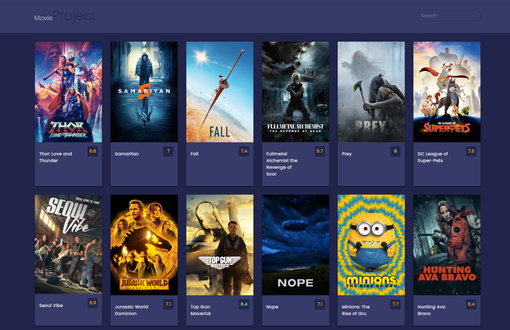

# Movie App

Code along Project using 3rd party APIs from themoviedb.org (giant movie database with titles, ratings, images etc. )

1. Create the UI with HTML/CSS (hover effect, overview, search functionality etc..)

2. Register API-Key with the tmdb-service
3. Fetch request to get the data to show the most popular movies
4. Adding stuff into the DOM :)

